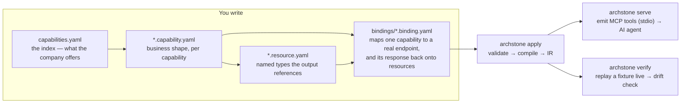
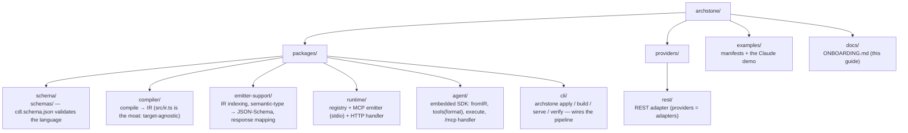

# Onboarding

Archstone is a **compiler** for the thing it calls *zero manual integration*: a company
describes what it can do in **CDL** (Capability Definition Language), and Archstone compiles
that description into tools AI agents can execute — no hand-written MCP server, no HTTP glue.

There are three ways to arrive here, and this guide serves all of them:

- **[Provider onboarding](#provider-onboarding)** — you have a business/API and want AI
  agents to be able to use it. You write CDL; Archstone does the integration.
- **[Embedding onboarding](#embedding-onboarding)** — you have (or are generating) a compiled
  IR artifact and want to consume it directly in your own app/agent loop without running
  Archstone's CLI. Zero MCP server process; you get typed tools and fail-closed execution.
- **[Contributor onboarding](#contributor-onboarding)** — you want to build Archstone
  itself (the compiler, providers, runtime).

Pick your path. They don't overlap much.

---

## Provider onboarding

> **Goal:** turn what your company does into agent-callable tools, without writing
> integration code. The entire integration is a handful of lines of CDL.

### What you need

- The Archstone CLI available — `npm install -g @archstone/cli` (or `npx @archstone/cli`), or
  see [Contributor onboarding](#contributor-onboarding) for a local checkout and `pnpm apply` /
  `pnpm serve` instead.
- An HTTP API behind your capability (a REST endpoint the binding points at). For a demo
  you can point at a mock; in production you point at a real backend.

### Try it now (no writing required)

Before writing a line of CDL, run the shipped example and watch the whole pipeline work
end to end — it's the fastest way to see what Steps 1–6 below actually produce:

```bash
pnpm apply examples/manifests/booking     # compile a 4-capability example
pnpm demo:tourism                                    # serve the tourism example over MCP
pnpm demo:mock                                       # (separate shell) a mock backend on :8787
pnpm verify examples/manifests/tourism               # replay the golden fixture, check for drift
```

### The mental model



Business definition (`*.capability.yaml` + `*.resource.yaml`) is kept **separate** from
technical wiring (`bindings/`). That separation is the point: swap the backend, and the CDL
and the generated tool do not change.

### Repository ownership & the stateless compiler

**Your manifest lives in your repository.** The CDL files you create in Steps 1–4 below
(`capabilities.yaml`, `*.capability.yaml`, `*.resource.yaml`, `bindings/*.binding.yaml`) are
authored and version-controlled in **your own application repository**, not in this Archstone
repository or any Archstone-owned fork. There is no dependency on Archstone's source tree.

**`@archstone/cli` is stateless.** When you run `archstone apply`, `archstone build`,
`archstone serve`, or `archstone verify`, the compiler needs no checkout of any Archstone
repository (public or private) — not at build time, not in CI, not at runtime. You install
`@archstone/cli` from npm into your own repository's dependencies; point it at your own
manifest directory on disk; it compiles and exits. That's the entire integration.

This matters because it means:
- Your manifest is versioned alongside your own code, not fetched live from Archstone.
- Your CI pipeline does not need credentials or access to any Archstone repository to build.
- The compiled artifact (if you use `archstone build`) is committed as part of your own
  deployment pipeline, owned by your team.

### Step 1 — Declare what you offer (`capabilities.yaml`)

This is the root of the diagram above: the compiler loads this file first, and anything not
listed here — a capability, a provider — doesn't exist as far as Archstone is concerned.

The iconic file. Like `openapi.yaml` or `docker-compose.yaml`, but for capabilities.

```yaml
# capabilities.yaml
company:
  id: booking
  name: Booking Holdings
  description: Global accommodation and travel services exposed to AI agents.

capabilities:
  - tourism.search
  - tourism.book

providers:
  - booking-api      # logical backends your capabilities bind to
  - payment
```

### Step 2 — Define each capability (business only)

This expands the `*.capability.yaml` node above, one file per entry you listed in Step 1.
Nothing here is servable yet — it's where you describe the business shape the compiler will
understand, independent of how (or whether) it ends up wired to a real backend.

One file per capability. **No URLs, no auth headers, no HTTP** — just the business shape.

```yaml
# tourism.search.capability.yaml   (CDL 0.2)
capability:
  id: tourism.search
  description: Find accommodation matching customer preferences.
  effect: read                     # read | write — drives safety/consent

  input:
    destination: { type: location }
    dates:       { type: date-range }
    travelers:   { type: party }
    preferences: { type: preference-set, required: false }

  output:
    accommodations:
      collection: Accommodation

  policies:
    - authenticated
    - rate-limited

  provider: booking-api            # which logical provider fulfils it
```

### Step 3 — Define the resources your capability returns (`*.resource.yaml`)

Step 2 referenced `Accommodation` before it was defined anywhere — that's intentional.
Resources live in their own files, the `*.resource.yaml` node above, separate from any one
capability, precisely so multiple capabilities — even across domains — can share the same
named type instead of redefining it inline each time.

`collection: Accommodation` above is a **reference**, not a definition — it must resolve to
a matching resource file, or the manifest fails to compile (`unknown-resource`). One file per
resource, named business entities with typed fields:

```yaml
# tourism.Accommodation.resource.yaml
resource:
  name: tourism.Accommodation
  description: A bookable place to stay matching a traveler's search.
  fields:
    name:
      type: text
      description: The property's display name.
    location:
      type: location
      description: Where the stay is — city, region, or address.
    pricePerNight:
      type: quantity
      description: Nightly rate for the stay.
    rating:
      type: quantity
      required: false
      description: Guest review score, when available.
```

A bare name (`Accommodation`) resolves inside the referring capability's own domain; a
cross-domain reference must be qualified (`tourism.Accommodation`). An ambiguous bare match
is a compile error, never a guess. The compiler carries the resolved fields through to the
emitter, which lowers them into a typed, described JSON Schema `outputSchema` on the tool —
the agent sees `Accommodation` has a `name`/`location`/`pricePerNight`/`rating`, not a bare
`{type: object}`.

> **Gotcha:** a field's own `description:` is used verbatim only for types with no built-in
> description of their own (`text`, `string`, `identifier`, `quantity`, …). For types the
> emitter already describes generically (`location`, `date-range`, `party`, `money`, `date`,
> `datetime`/`time-slot`, `enum`), the generic description wins over whatever you wrote. Don't
> rely on a custom description surfacing for those types.

### Step 4 — Bind it to a real endpoint (`bindings/`)

This is the `bindings/*.binding.yaml` node — the only file in the whole flow allowed to know
about HTTP. Everything you wrote in Steps 2–3 stays true no matter what you point this file at.

The one place technical detail lives. Secrets and hostnames come from the environment
(`${VAR}`), never hard-coded. A binding also maps the provider's response onto the resource
it produces (`response:`) — the resource is the anchor; JSON paths are the only thing that
moves if the backend renames a field:

```yaml
# bindings/tourism.search.binding.yaml
binding:
  capabilityId: tourism.search
  connector:
    type: rest
    rest:
      baseUrl: "${BOOKING_API_URL}"
      method: POST
      path: /api/v1/hotels/search

  response:
    collection: "$.results[*]"        # JSONPath to the item list in the provider body
    resource: Accommodation
    map:
      name: "$.name"
      location: "$.location"
      pricePerNight: "$.pricePerNight"
      rating: "$.rating"              # optional on the resource → may be absent without failing
```

Here's what that provider actually returns — the shape `response:` above is written against:

```json
// POST /api/v1/hotels/search → 200 OK
{
  "results": [
    { "name": "Hotel Azur",    "location": "Nice, France", "pricePerNight": 142, "rating": 4.6 },
    { "name": "Dunes Resort",  "location": "Nice, France", "pricePerNight": 98 }
  ]
}
```

Read the two side by side: `collection: "$.results[*]"` walks into the array; each entry
under `map:` is a JSONPath applied to *one element* of it — `name: "$.name"` pulls
`"Hotel Azur"` straight off the first element, `location: "$.location"` pulls
`"Nice, France"`, and so on. The second result has no `rating` at all — and since `rating`
is `required: false` on `Accommodation` (Step 3), that's fine.

That's the general rule the runtime applies to every mapped element, checked against
`Accommodation`'s required fields:

- every required field present → **OK** — mapped data returned as `structuredContent`;
- an **optional** field missing → **DEGRADED** — returned, that field omitted, a warning surfaced;
- a **required** field missing → **VIOLATION** — fail closed: the tool returns `isError:true` with
  a human-readable `content` message plus a structured error object in
  `CallToolResult._meta["dev.archstone/contract_violation"]` containing `{error: "contract_violation", capability, missing}` — **not** the raw provider body. The agent can branch deterministically on the
  stable error code instead of parsing prose.

A capability with **no** binding still validates — it just isn't invocable yet (`apply`
warns and reports it as not bound). A binding with **no** `response:` still validates too —
the runtime falls back to today's raw pass-through for that tool (rollout-safe), but the
declared `outputSchema` isn't enforced for it. This lets you declare intent before the
mapping exists, but map the response before you trust the shape you get back.

### Step 5 — Compile and inspect

You don't need every capability bound to run this. A capability with no binding still
validates (see the note above), so it's worth running `apply` as soon as Step 3 is done, and
again after every change, rather than treating it as a single gate at the very end.

```bash
archstone apply ./my-manifest-dir
```

You'll see the company, providers, each loaded capability with its `effect` and provider,
schema validation, semantic errors/warnings, and the registry IR summary — e.g.
`registry IR v0 — 4 capabilities, 1 invocable (bound)`. Warnings (unused provider, missing
binding) are safe to iterate on; **errors** must reach zero before you serve.

### Step 6 — Serve it to an AI agent

This is where the IR that `apply` produced becomes something an agent can actually call —
the last arrow in the diagram above.

```bash
archstone serve ./my-manifest-dir
```

This emits your bound capabilities as **MCP tools over stdio**. Point an agent at it. For
Claude Desktop, add the server to `claude_desktop_config.json`, set any `${VAR}` your
bindings use in the `env` block, and restart — the tool (e.g. `tourism_search`) appears and
the agent can call it. A complete, copy-pasteable Claude Desktop walkthrough lives in
[`examples/demo/README.md`](../examples/demo/README.md).

### Acting on behalf of the end user (`policies: [authenticated]`)

Everything in Steps 1–6 above — and the tourism/booking examples — describes **sandbox /
service-account** capabilities: the binding's `${VAR}` placeholders resolve against your own
backend's static secrets (an API key, a service-account token), and any caller can invoke the
tool with the same result. That's unaffected by what follows, and remains fully valid for most
demos and internal-tool capabilities.

A capability that acts on **one specific end user's own data** — "show *my* accounts", not
"search hotels" — is a different case, and Archstone will not let it silently fall back to a
service account. Wire it up like this:

1. **Declare it** — add `authenticated` to the capability's `policies:` (Step 2). Optionally
   add `tenant-scoped` too, though note that policy is reserved and **not yet enforced** by
   Archstone itself.
2. **Bind it** — reference the caller's own credential in the binding (Step 4) with a second
   placeholder namespace, `${caller.accessToken}`, resolved independently of `${VAR}`/env:
   ```yaml
   binding:
     capabilityId: banking.list-accounts
     connector:
       type: rest
       rest:
         baseUrl: "${CORE_BANKING_URL}"
         method: GET
         path: /v2/accounts
         headers:
           Authorization: "Bearer ${caller.accessToken}"
   ```
   `archstone apply` warns (`authenticated-capability-no-caller-placeholder`) if an
   `authenticated` capability's binding never references `${caller.…}` — advisory only, but a
   sign the capability will always fail closed once served.

   `${caller.…}` can also appear in `baseUrl` — e.g. `baseUrl:
   "https://${caller.tenantId}.core.example.com"` for per-tenant host routing. Because a value
   here controls *where the whole request goes* (not just its content, like headers/body), any
   binding that does this **must** also set `allowedHosts` (an exact hostname or a `"*."`
   subdomain wildcard, e.g. `["*.core.example.com"]`) wherever it invokes — on `serveStdio`'s
   `invoke`, `createHttpHandler`'s `invoke`, or `execute()`'s options. With no `allowedHosts`
   configured, such a call fails closed by default; `archstone apply` warns
   (`caller-influenced-baseurl-no-allowlist`) as a reminder. Bindings that only use
   `${caller.…}` in headers/query/body are unaffected — this only applies to `baseUrl`.
3. **Supply the token at invoke time.** **Archstone does not host an OIDC broker or validate
   tokens itself** — it is the host's job to authenticate the end user first, then hand
   Archstone the resulting token through whichever entrypoint it's serving from:
   - `archstone serve` (stdio) — pass a static `invoke: { caller }` to `serveStdio()`. A stdio
     server is one child process per conversation (Claude Desktop's model), so a fixed
     per-process caller is architecturally correct here — there's exactly one end user for the
     life of that process.
   - `createHttpHandler`/`archstone serve --http` — pass `resolveCaller: (request) =>
     ({ accessToken })`, a hook called fresh for **every** inbound request, so two concurrent
     requests from two different end users each get their own token. This is orthogonal to
     `bearerToken`: `bearerToken` gates who may reach the MCP endpoint *at all*;
     `resolveCaller` decides whose backend data a given, already-authorized call acts on. Set
     both — one doesn't substitute for the other.
   - `@archstone/agent`'s `execute()` — pass `{ caller: { accessToken } }` directly on each call.

With no caller supplied (any of the three ways above) on an `authenticated` capability, the
call fails closed **before any request reaches your backend**, with an error naming the
capability — never a silent service-account fallback.

---

### After you ship: keeping the contract honest

Once you're serving real tools to real agents, the backend behind a binding can change shape
without warning — a renamed field, a new required parameter — and nothing above catches that
after the fact. `archstone verify` is how you find out before an agent does. Unlike Steps 1–6,
it isn't something you do once during setup: run it on whatever cadence fits (a cron job, a CI
gate), for as long as the binding is live.

A binding can also declare a `contract:` block — a fingerprint of the provider's response
shape plus a pointer to a golden fixture (`fixtures/<capabilityId>.golden.json`, a recorded
request):

```yaml
  contract:
    source: recorded
    fingerprint: "sha256:…"
    probe:
      fixture: fixtures/tourism.search.golden.json
```

```bash
archstone verify ./my-manifest-dir
```

replays the fixture's request against the **live** backend, runs it through the same
`response:` mapping a real call would use, and reports a per-binding health status:
🟢 unchanged, 🟡 shape drifted or a field degraded, 🔴 a required field went missing or the
request itself failed. It exits non-zero on any 🔴, so it drops straight into a CI job as a
drift gate. It's the only Archstone command that makes a live network call outside a real
tool invocation — on demand only, never triggered by `apply`/`serve`. Wiring it to a schedule
(cron, a CI job) is your call, not Archstone's.

---

## Embedding onboarding

> **Goal:** take a compiled IR artifact and embed it directly in your own application or agent
> loop, consuming typed tools and fail-closed execution without running Archstone's CLI.

### Who this is for

You already have (or are generating) a compiled IR artifact from an Archstone manifest, and you
want to consume it directly in your own product — a web application, a backend service, an AI
agent embedded in another product — without spinning up Archstone's own MCP server process.
For example: an assistant embedded in a travel-booking SaaS wants to call the same tools the
booking backend exposes; you compile the manifest once, ship the IR as a static JSON artifact,
and load it directly into your agent loop.

### Compile and capture the artifact

Start with the same CDL you would use for [Provider onboarding](#provider-onboarding) — all
Steps 1–4 are identical. The difference is in what you do with the result: instead of running
`archstone serve`, compile once and write a portable IR artifact:

```bash
archstone build ./my-manifest-dir
```

This produces `archstone.ir.json` (or `--out <path>` to customize the output location). The
artifact is standalone: it contains the full compiled IR (`version: "0"`), with contract
fingerprints and golden fixtures **stripped** — you ship only the IR itself, making it safe to
include in a built application or serve from a static CDN.

You can commit this artifact to version control, ship it as part of a release, or regenerate
it in your CI/CD pipeline. It's the glue between Archstone's compile pipeline and your own
application.

### Commit the artifact in your own repository

The compiled `archstone.ir.json` artifact belongs **alongside your own application code, in
your own repository**. Treat it the same way you would any other build artifact: commit it
to version control so your deployed application has a stable, versioned contract that doesn't
change unexpectedly at runtime.

This means:
- **You own the artifact's version history.** When you rebuild your manifest (e.g., because
  you added a capability), you regenerate and commit the new `archstone.ir.json` in the same
  commit as your application code.
- **No live fetch at runtime.** The artifact is static — your app loads it from disk (or from
  your build output) at startup, never over the network. There is no "latest" version your app
  auto-upgrades to; you control exactly which version ships.
- **Zero Archstone checkout.** Just as the CLI needs no Archstone repository, neither does
  your deployed app. The artifact is a compiled output, not a source dependency.

### Load it into `@archstone/agent`

Install the embedded SDK:

```bash
npm install @archstone/agent
```

Then load the IR and construct an Archstone instance:

```typescript
import { fromIR } from "@archstone/agent";
import fs from "node:fs";

// Load the artifact (e.g., from file, fetch, or inline)
const ir = JSON.parse(fs.readFileSync("archstone.ir.json", "utf-8"));
const archstone = fromIR(ir);
```

If the artifact isn't a valid `version: "0"` IR, `fromIR()` throws an `InvalidArtifactError` —
it fails closed rather than proceeding on a shape it doesn't recognize.

### Generate typed tool definitions

Once you have an Archstone instance, generate tool definitions in your preferred format:

```typescript
// Get tools in your target format (zero MCP SDK loaded here)
const anthropicTools = archstone.tools("anthropic");  // Anthropic SDK format
const openaiTools = archstone.tools("openai");        // OpenAI SDK format
const geminiTools = archstone.tools("gemini");        // Google Gemini format
const jsonSchemaTools = archstone.tools("json-schema"); // Plain JSON Schema
```

Each tool includes a `name`, a `description` (as the AI agent sees it), and an `inputSchema`
(from the semantic types defined in your CDL). The agent can discover and reason about them —
no hand-written tool definitions.

### Invoke capabilities with fail-closed semantics

Execute a capability just as you would in `archstone serve`, but directly in your code:

```typescript
// execute() accepts both raw dotted id and sanitized tool name (as returned by tools())
const result = await archstone.execute("tourism.search", {
  destination: "Paris",
  checkInDate: "2026-08-01",
  travelers: { adults: 2, children: 0 },
});
// Same call with sanitized tool name: await archstone.execute("tourism_search", {...});

if (result.status === "ok") {
  console.log("Success:", result.data);
} else if (result.status === "degraded") {
  console.log("Partial result:", result.data, "Missing optional fields:", result.degraded);
} else if (result.status === "violation") {
  console.log("Contract violation — required fields missing:", result.missing);
} else if (result.status === "error") {
  console.log("Transport/connector error:", result.error);
}
```

The result mirrors the same **OK/DEGRADED/VIOLATION/ERROR** semantics from
[Step 4's fail-closed mapping](#step-4--bind-it-to-a-real-endpoint-bindings):
- **OK** — all required fields present, returned as `data`.
- **DEGRADED** — optional fields missing, returned as `data` with `degraded` listing the missing names.
- **VIOLATION** — a required field missing; `missing` lists it (structured, not prose), so agents
  can branch deterministically.
- **ERROR** — transport failure (missing env var, network error, non-2xx response); `error` contains
  a human-readable message.

`execute()` accepts an optional `env` object (Workers-style, never `process.env`) for
injecting environment variables into `${VAR}` placeholders in your bindings — useful for
passing secrets or configuration without baking them into the artifact.

```typescript
const result = await archstone.execute(
  "tourism.search",  // or "tourism_search" (sanitized name as returned by tools())
  { destination: "Paris", checkInDate: "2026-08-01", travelers: { adults: 2 } },
  { env: { BOOKING_API_URL: "https://api.booking.example.com" } }
);
```

For a capability that declares `policies: [authenticated]` — see
["Acting on behalf of the end user"](#acting-on-behalf-of-the-end-user-policies-authenticated)
above — pass the end user's own token per call instead:

```typescript
const result = await archstone.execute(
  "banking.list-accounts",
  {},
  { caller: { accessToken: endUserAccessToken } } // from YOUR app's own auth session
);
```

### Observing cost & usage data from backend invocations

If a bound capability's own backend charges per token — for example, a `summarize-review`
capability whose connector calls a paid LLM completions API — you can observe that cost/usage
data without Archstone parsing or normalizing the provider's response shape.

**For orchestrating-model calls:** The model call that decided *which* tool to invoke (the
agent loop step) lives entirely outside Archstone — Archstone's `execute()` only fulfills a
tool call the model already decided to make. Usage and cost data from that decision call
(`input_tokens`/`output_tokens` on Anthropic, `usage` on OpenAI, `usageMetadata` on Gemini)
come from your model provider's own API response, not through Archstone. See the internal
design rationale (ADD-31 spike findings) for the full architectural reasoning — Archstone has no
seam there by construction.

**For bound-backend calls:** Register an `onResponse` hook on `execute()`'s options. It fires
exactly once per completed HTTP round-trip (both success and error status) with the raw,
unmapped response body — strictly before response-mapping or VIOLATION logic runs — so you can
extract whatever cost/usage fields your own backend returns, using knowledge only you have:

```typescript
const result = await archstone.execute(
  "summarize-review",
  { text: "Great hotel, friendly staff..." },
  {
    env: { SUMMARIZER_API_URL: "https://api.anthropic.com" },
    onResponse: async (info) => {
      // info: { capabilityId: string; status: number; data: unknown; durationMs: number }
      // data is the raw, unmapped response body
      if (info.data && typeof info.data === "object" && "usage" in info.data) {
        const usage = (info.data as Record<string, unknown>).usage;
        console.log(`[${info.capabilityId}] tokens:`, usage, `duration: ${info.durationMs}ms`);
      }
    },
  }
);
```

The hook never fires on early fail-closed returns (missing env var, missing path parameter, missing
caller credential on an `authenticated` capability, disallowed host on a `${caller.…}`-influenced
`baseUrl`, or network exceptions). Any thrown exception or rejected promise from the hook is
caught and logged to stderr — never propagated into the invocation's own result, so a
misbehaving hook can never delay or fail a tool call. **Archstone does not parse or normalize**
provider-specific usage shapes — binding authors extract what they need using their own
knowledge of their backend.

### Expose it as an MCP endpoint (optional)

If you want to also surface the embedded instance as an MCP server — for example, to mount it
in the Claude API's `mcp_servers` config or expose it to other clients over HTTP — use the
`/mcp` subpath:

```typescript
import { mcpHandler } from "@archstone/agent/mcp";

const handler = mcpHandler(archstone, {
  bearerToken: process.env.ARCHSTONE_TOKEN, // required; empty throws at construction
});
```

This returns a Web-standard `(request: Request) => Promise<Response>` handler — mountable in
any Web-standard-Request runtime (Cloudflare Workers, Node via a fetch adapter, etc.):

```typescript
// E.g., in a Cloudflare Worker
export default {
  fetch(request: Request): Promise<Response> {
    return handler(request);
  },
};

// E.g., in a Node.js app with a framework like Hono
import { Hono } from "hono";
const app = new Hono();
app.all("*", async (c) => handler(c.req.raw));
```

The handler is a thin wrapper — it reuses the same Registry from the embedded instance, applies
the same bearer-token gate as `archstone serve --http`, and enforces the same "no CORS by
default" posture as the CLI. Never a separate method on the Archstone instance itself — this
separation ensures that consumers who only ever call `tools()`/`execute()` never pull in the
MCP SDK into their bundle (RFC-0008, Architecture Challenge R-1).

The bearer token is **required** and checked at handler construction, not on the first request
(Rule #7 — core never ships open by default). If you're running in an environment without
secrets (e.g., a public demo), you must explicitly provide one anyway, even if it's a dummy
value.

### Where Archstone's own CLI fits

The CLI's `archstone serve --http` command does the same work: it compiles your manifest,
builds a Registry, and wraps it in the same HTTP handler machinery. You use `--http` when you
want Archstone itself to own the server. You use the embedded SDK (`fromIR()` + `mcpHandler()`)
when you want to run the handler inside your own application — giving you full control over
how it's deployed, scaled, and integrated with your existing stack.

```bash
# Archstone runs the HTTP server for you
archstone serve --http ./my-manifest-dir --port 8787 --token "my-secret"

# vs.

# You run the HTTP server; Archstone is just a dependency
// In your app.ts:
const archstone = fromIR(compiledArtifact);
const handler = mcpHandler(archstone, { bearerToken: "my-secret" });
// Mount handler on your framework of choice
```

Both paths produce the same MCP protocol behavior — the difference is operational.

---

## Contributor onboarding

> **Goal:** get a green checkout, understand the layout, and know how work is done here
> before you touch code.

### Prerequisites

| Tool | Version |
|---|---|
| Node.js | 22+ (repo developed on 26) |
| pnpm | 11+ (`packageManager` pins the exact version) |
| Git | any recent |

### Get a green checkout

```bash
git clone https://github.com/Archstone-Romania/archstone
cd archstone
pnpm install
pnpm lint             # eslint
pnpm typecheck        # tsc, strict
pnpm test             # vitest — includes the end-to-end MCP demo integration test
```

Then confirm the pipeline runs end to end:

```bash
pnpm demo:booking     # apply the booking manifest → validation + IR report
pnpm demo:tourism     # serve the tourism manifest as MCP tools
```

If `lint`, `typecheck`, `test`, and the demos all succeed, your environment is good. These
are the same four checks CI runs on every PR (see "Contributing a change" below) — green
locally means a PR you open won't fail for reasons unrelated to your change.

### Repository layout



The compiler never lets `apply` poke a target directly — it compiles to an **IR**, and
emitters (MCP now; REST · GraphQL · SDK later) consume the IR. Keep that boundary intact:
the IR is the reason the product survives a protocol change.

### Contributing a change

Standard open-source flow:

1. Fork the repo and create a branch.
2. Make your change. Keep `pnpm typecheck` and `pnpm test` green.
3. Open a pull request against `main`. CI runs typecheck + test on every PR.

Small, focused PRs merge fastest. If you're proposing something larger (a new provider type,
a change to the IR or CDL), open an issue first so the design can be discussed before you
build.

### Conventions

- **Schema before core.** The language (`schemas/`) and its examples are validated before
  the compiler that consumes them. Don't build a feature ahead of the schema that defines it.
- **CDL is business-only.** Anything technical (URLs, auth, HTTP verbs) belongs in a
  `binding`, never in a `*.capability.yaml`.
- **Respect the layer boundaries.** The IR is target-agnostic (no MCP, no HTTP, no JSON Schema).
  The MCP SDK appears only in `runtime`'s emitter and `agent`'s `/mcp` subpath. Semantic-type
  → JSON-Schema lowering and response mapping live in `emitter-support`, shared by all emitters.
  HTTP appears only in `providers/`. The compiler never wires YAML directly to MCP or HTTP.
- **TypeScript strict**, pnpm workspaces, Vitest.

### Where to look first

| To understand | Read |
|---|---|
| The language, by example | [`examples/manifests/`](../examples/manifests/) |
| The wire format (schemas) | [`packages/schema/schemas/`](../packages/schema/schemas/) |
| The moat (IR) | [`packages/compiler/src/ir.ts`](../packages/compiler/src/ir.ts) |
| Embedding the SDK | [`packages/agent/README.md`](../packages/agent/README.md) |
| Response mapping & JSON-Schema lowering | [`packages/emitter-support/`](../packages/emitter-support/) |
| The end-to-end demo | [`examples/demo/README.md`](../examples/demo/README.md) |
