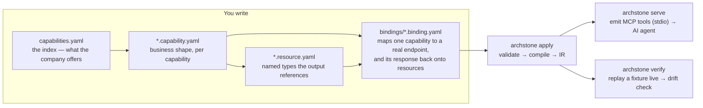
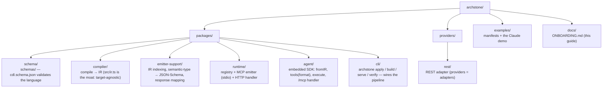

# Onboarding

Archstone is a **compiler** for the thing it calls *zero manual integration*: a company
describes what it can do in **CDL** (Capability Definition Language), and Archstone compiles
that description into tools AI agents can execute — no hand-written MCP server, no HTTP glue.

There are three ways to arrive here, and this guide serves all of them:

- **[Provider onboarding](#provider-onboarding)** — you have a business/API and want AI
  agents to be able to use it. You write CDL; Archstone does the integration.
- **[Embedding onboarding](#embedding-onboarding)** — you have (or are generating) a compiled
  IR artifact and want to consume it directly in your own app/agent loop without running
  Archstone's CLI. Zero MCP server process; you get typed tools and fail-closed execution.
- **[Contributor onboarding](#contributor-onboarding)** — you want to build Archstone
  itself (the compiler, providers, runtime).

Pick your path. They don't overlap much.

---

## Provider onboarding

> **Goal:** turn what your company does into agent-callable tools, without writing
> integration code. The entire integration is a handful of lines of CDL.

### What you need

- The Archstone CLI available — `npm install -g @archstone/cli` (or `npx @archstone/cli`), or
  see [Contributor onboarding](#contributor-onboarding) for a local checkout and `pnpm apply` /
  `pnpm serve` instead.
- An HTTP API behind your capability (a REST endpoint the binding points at). For a demo
  you can point at a mock; in production you point at a real backend.

### Already have an OpenAPI document? Start with `archstone init`

Steps 1–6 below are the authoritative model, and reading them is how you will understand what
your manifest means. But if your API already has an OpenAPI 3.0/3.1 description, you do not
have to type the first draft:

```bash
archstone init path/to/openapi.yaml --out my-manifest --domain catalog
```

`init` reads the document, proposes one candidate per operation, and asks you the questions no
tool can answer for you — *is this a capability? is it `read`? what is it called?* Then it
writes the manifest **only if the real compiler compiles it**. There are exactly two outcomes:
a compiling manifest, or nothing written and a report saying why.

What it deliberately does **not** do, and why each one matters:

| It never… | Because |
|---|---|
| uses an LLM, on any path | the same input must produce the same output on every run, so you can put it in CI and diff the result |
| guesses an `effect` | you run `init`; your business pays for a wrong `effect` months later, through an agent, in front of a customer |
| invents a capability id, a domain or a resource name | those are your product's vocabulary, and a name Archstone made up is a name nobody agreed to |
| write anything to your backend | probes are opt-in (`--probe`), read-only, gated on a confirmed `effect: read` **and** the HTTP method, and refused outright without a terminal for anything but `GET`/`HEAD` |
| emit a `contract:` it did not record | a fingerprint without a real response makes `archstone verify` green against a fiction |

Anything it cannot express faithfully is **skipped with a named reason and emitted as nothing**
— never half-written. The report lists every one, plus the per-field things only you can
decide: which `string` is really a `money`, and which `identifier` is really a `ref:` to a
resource another capability returns.

Read the report before you commit. `init` gets you a compiling draft; it does not get you a
good one, and the difference is entirely in the names and descriptions an agent will read.

Then continue with Steps 1–6 to understand and refine what it wrote.

### Try it now (no writing required)

Before writing a line of CDL, run the shipped example and watch the whole pipeline work
end to end — it's the fastest way to see what Steps 1–6 below actually produce:

```bash
pnpm apply examples/manifests/booking     # compile a 4-capability example
pnpm demo:tourism                                    # serve the tourism example over MCP
pnpm demo:mock                                       # (separate shell) a mock backend on :8787
pnpm verify examples/manifests/tourism               # replay the golden fixture, check for drift
```

### The mental model


```mermaid
flowchart LR
    subgraph write["You write"]
        CAPS["capabilities.yaml<br/>the index — what the company offers"]
        CAP["*.capability.yaml<br/>business shape, per capability"]
        RES["*.resource.yaml<br/>named types the output references"]
        BIND["bindings/*.binding.yaml<br/>maps one capability to a real endpoint,<br/>and its response back onto resources"]
    end
    CAPS --> CAP
    CAP --> RES
    CAP --> BIND
    RES --> BIND
    BIND --> APPLY["archstone apply<br/>validate → compile → IR"]
    APPLY --> SERVE["archstone serve<br/>emit MCP tools (stdio) → AI agent"]
    APPLY --> VERIFY["archstone verify<br/>replay a fixture live → drift check"]
```

Business definition (`*.capability.yaml` + `*.resource.yaml`) is kept **separate** from
technical wiring (`bindings/`). That separation is the point: swap the backend, and the CDL
and the generated tool do not change.

### Repository ownership & the stateless compiler

**Your manifest lives in your repository.** The CDL files you create in Steps 1–4 below
(`capabilities.yaml`, `*.capability.yaml`, `*.resource.yaml`, `bindings/*.binding.yaml`) are
authored and version-controlled in **your own application repository**, not in this Archstone
repository or any Archstone-owned fork. There is no dependency on Archstone's source tree.

**`@archstone/cli` is stateless.** When you run `archstone apply`, `archstone build`,
`archstone serve`, or `archstone verify`, the compiler needs no checkout of any Archstone
repository (public or private) — not at build time, not in CI, not at runtime. You install
`@archstone/cli` from npm into your own repository's dependencies; point it at your own
manifest directory on disk; it compiles and exits. That's the entire integration.

This matters because it means:
- Your manifest is versioned alongside your own code, not fetched live from Archstone.
- Your CI pipeline does not need credentials or access to any Archstone repository to build.
- The compiled artifact (if you use `archstone build`) is committed as part of your own
  deployment pipeline, owned by your team.

### Step 1 — Declare what you offer (`capabilities.yaml`)

This is the root of the diagram above: the compiler loads this file first, and anything not
listed here — a capability, a provider — doesn't exist as far as Archstone is concerned.

The iconic file. Like `openapi.yaml` or `docker-compose.yaml`, but for capabilities.

```yaml
# capabilities.yaml
company:
  id: booking
  name: Booking Holdings
  description: Global accommodation and travel services exposed to AI agents.

capabilities:
  - tourism.search
  - tourism.book

providers:
  - booking-api      # logical backends your capabilities bind to
  - payment
```

### Step 2 — Define each capability (business only)

This expands the `*.capability.yaml` node above, one file per entry you listed in Step 1.
Nothing here is servable yet — it's where you describe the business shape the compiler will
understand, independent of how (or whether) it ends up wired to a real backend.

One file per capability. **No URLs, no auth headers, no HTTP** — just the business shape.

```yaml archstone-fixture=tourism as=tourism.search.capability.yaml
# tourism.search.capability.yaml   (CDL 0.2)
capability:
  id: tourism.search
  description: Find accommodation matching customer preferences.
  effect: read                     # read | write — drives safety/consent

  input:
    destination: { type: location }
    dates:       { type: date-range }
    travelers:   { type: party }
    preferences: { type: preference-set, required: false }

  output:
    accommodations:
      collection: Accommodation

  policies:
    - authenticated
    - rate-limited

  provider: booking-api            # which logical provider fulfils it
```

### Step 3 — Define the resources your capability returns (`*.resource.yaml`)

Step 2 referenced `Accommodation` before it was defined anywhere — that's intentional.
Resources live in their own files, the `*.resource.yaml` node above, separate from any one
capability, precisely so multiple capabilities — even across domains — can share the same
named type instead of redefining it inline each time.

`collection: Accommodation` above is a **reference**, not a definition — it must resolve to
a matching resource file, or the manifest fails to compile (`unknown-resource`). One file per
resource, named business entities with typed fields:

```yaml
# tourism.Accommodation.resource.yaml
resource:
  name: tourism.Accommodation
  description: A bookable place to stay matching a traveler's search.
  fields:
    name:
      type: text
      description: The property's display name.
    location:
      type: location
      description: Where the stay is — city, region, or address.
    pricePerNight:
      type: quantity
      description: Nightly rate for the stay.
    rating:
      type: quantity
      required: false
      description: Guest review score, when available.
```

A bare name (`Accommodation`) resolves inside the referring capability's own domain; a
cross-domain reference must be qualified (`tourism.Accommodation`). An ambiguous bare match
is a compile error, never a guess. The compiler carries the resolved fields through to the
emitter, which lowers them into a typed, described JSON Schema `outputSchema` on the tool —
the agent sees `Accommodation` has a `name`/`location`/`pricePerNight`/`rating`, not a bare
`{type: object}`.

> **Gotcha:** a field's own `description:` is used verbatim only for types with no built-in
> description of their own (`text`, `string`, `identifier`, `quantity`, …). For types the
> emitter already describes generically (`location`, `date-range`, `party`, `money`, `date`,
> `datetime`/`time-slot`, `enum`), the generic description wins over whatever you wrote. Don't
> rely on a custom description surfacing for those types.

### Step 4 — Bind it to a real endpoint (`bindings/`)

This is the `bindings/*.binding.yaml` node — the only file in the whole flow allowed to know
about HTTP. Everything you wrote in Steps 2–3 stays true no matter what you point this file at.

The one place technical detail lives. Secrets and hostnames come from the environment
(`${VAR}`), never hard-coded. A binding also maps the provider's response onto the resource
it produces (`response:`) — the resource is the anchor; JSON paths are the only thing that
moves if the backend renames a field:

```yaml
# bindings/tourism.search.binding.yaml
binding:
  capabilityId: tourism.search
  connector:
    type: rest
    rest:
      baseUrl: "${BOOKING_API_URL}"
      method: POST
      path: /api/v1/hotels/search

  response:
    collection: "$.results[*]"        # JSONPath to the item list in the provider body
    resource: Accommodation
    map:
      name: "$.name"
      location: "$.location"
      pricePerNight: "$.pricePerNight"
      rating: "$.rating"              # optional on the resource → may be absent without failing
```

Here's what that provider actually returns — the shape `response:` above is written against:

```json
// POST /api/v1/hotels/search → 200 OK
{
  "results": [
    { "name": "Hotel Azur",    "location": "Nice, France", "pricePerNight": 142, "rating": 4.6 },
    { "name": "Dunes Resort",  "location": "Nice, France", "pricePerNight": 98 }
  ]
}
```

Read the two side by side: `collection: "$.results[*]"` walks into the array; each entry
under `map:` is a JSONPath applied to *one element* of it — `name: "$.name"` pulls
`"Hotel Azur"` straight off the first element, `location: "$.location"` pulls
`"Nice, France"`, and so on. The second result has no `rating` at all — and since `rating`
is `required: false` on `Accommodation` (Step 3), that's fine.

That's the general rule the runtime applies to every mapped element, checked against
`Accommodation`'s required fields:

- every required field present → **OK** — mapped data returned as `structuredContent`;
- an **optional** field missing → **DEGRADED** — returned, that field omitted, a warning surfaced;
- a **required** field missing → **VIOLATION** — fail closed: the tool returns `isError:true` with
  a human-readable `content` message plus a structured error object in
  `CallToolResult._meta["dev.archstone/contract_violation"]` containing `{error: "contract_violation", capability, missing}` — **not** the raw provider body. The agent can branch deterministically on the
  stable error code instead of parsing prose.

A capability with **no** binding still validates — it just isn't invocable yet (`apply`
warns and reports it as not bound). A binding with **no** `response:` still validates too —
the runtime falls back to today's raw pass-through for that tool (rollout-safe), but the
declared `outputSchema` isn't enforced for it. This lets you declare intent before the
mapping exists, but map the response before you trust the shape you get back.

### Step 5 — Compile and inspect

You don't need every capability bound to run this. A capability with no binding still
validates (see the note above), so it's worth running `apply` as soon as Step 3 is done, and
again after every change, rather than treating it as a single gate at the very end.

```bash
archstone apply ./my-manifest-dir
```

You'll see the company, providers, each loaded capability with its `effect` and provider,
schema validation, semantic errors/warnings, and the registry IR summary — e.g.
`registry IR v0 — 4 capabilities, 1 invocable (bound)`. Warnings (unused provider, missing
binding) are safe to iterate on; **errors** must reach zero before you serve.

### Step 6 — Serve it to an AI agent

This is where the IR that `apply` produced becomes something an agent can actually call —
the last arrow in the diagram above.

```bash
archstone serve ./my-manifest-dir
```

This emits your bound capabilities as **MCP tools over stdio**. Point an agent at it. For
Claude Desktop, add the server to `claude_desktop_config.json`, set any `${VAR}` your
bindings use in the `env` block, and restart — the tool (e.g. `tourism_search`) appears and
the agent can call it. A complete, copy-pasteable Claude Desktop walkthrough lives in
[`examples/demo/README.md`](../examples/demo/README.md).

#### What the client is told about risk

The `effect` you confirmed in Step 2 does not stop at the compiler. Every tool in `tools/list`
carries **MCP tool annotations** derived from it — identically over stdio and over HTTP:

| `effect` | annotations emitted |
| --- | --- |
| `read` | `readOnlyHint: true` |
| `write` | `destructiveHint: false` |
| `irreversible` | `destructiveHint: true`, `idempotentHint: false` |

`write`'s lone `false` is doing real work: MCP treats an **absent** `destructiveHint` as
**true**, so stating it is the only thing that stops a `write` reaching the client
indistinguishable from an `irreversible`. It is also the loosest of the three pairings, and
worth reading precisely: MCP describes `destructiveHint: false` as a tool whose updates are
purely additive, while CDL's `write` means *modifies, reversibly* — `tourism.cancel` is a
`write` and is plainly not additive. Take `destructiveHint: false` to mean **not irreversible**,
which is the distinction CDL actually draws, and nothing finer.

Nothing else is emitted — no `openWorldHint`, no `title`. Archstone knows a capability's effect;
it does not know the shape of the world behind your connector, and a guess there would be
indistinguishable, to a client, from a fact.

**What you can rely on, precisely:**

- **The value crosses the wire, faithfully and unconditionally.** Whatever `effect` you
  declared is what the client is told, for every listed tool, on both transports.
- **That is the entire guarantee.** An annotation is a *hint*. The client may honour it,
  weaken it, or ignore it — MCP itself tells clients not to base tool-use decisions on
  annotations from servers they do not trust, and plenty of clients surface none of this at
  all. Archstone does not gate, refuse, delay, or retry anything on `effect`; it discloses,
  it does not enforce. If you need a capability to require approval, an annotation is not the
  mechanism, and today Archstone has no other: `policies: [human-approval]` is accepted and
  **unenforced**, which `archstone apply` warns you about by name.
- **It is exactly as true as your manifest.** The annotation is a faithful lowering of what
  you wrote, not an audit of what your backend does. A `POST /charges` declared `effect: read`
  is advertised as read-only, and nothing in the pipeline can tell. This is why `archstone
  init` refuses to guess an `effect` and makes you confirm each one.
- **MCP only.** `@archstone/agent`'s `tools()` emits no equivalent, because none of the
  Anthropic, OpenAI, Gemini or plain-JSON-Schema tool formats has a field that means this. See
  [Generate typed tool definitions](#generate-typed-tool-definitions).

What it buys you: a client that *does* surface annotations can tell `tourism.search` from
`banking.initiate-transfer` before it puts a confirmation dialog in front of a human. Before
this, that dialog saw the two as identical.

### Step 7 — Make it reachable (deploy)

`archstone serve` runs on your machine, over stdio. That is the whole story for Claude Desktop
and it is not enough for anything else: ChatGPT, Claude on the web or a phone, and your
teammates all need a **public HTTPS endpoint**.

Nothing about that is hosted by us — the compiled artifact is yours and so is the deployment.
What the shape of it looks like is a copy-and-edit template:

**[`examples/deploy/cloudflare-worker/`](../examples/deploy/cloudflare-worker/)**

```bash
cp -r examples/deploy/cloudflare-worker my-archstone-mcp
cd my-archstone-mcp && npm install
archstone build ../my-manifest-dir --out src/archstone.ir.json
openssl rand -hex 32 | wrangler secret put ARCHSTONE_HTTP_TOKEN
npm run deploy
```

The Worker itself is about twenty lines, because the work already happened at compile time:
`archstone build` produced a portable artifact, and `mcpHandler` is a Web-standard
`(Request) => Promise<Response>` — which is exactly a Worker's fetch handler.

Two things worth internalising before you deploy anything:

- **The endpoint is bearer-gated, and that token is not user authentication.** It decides who
  may reach the endpoint at all; it says nothing about *whose data* a call acts on. Capabilities
  that act per-user also need `resolveCaller` — see [Acting on behalf of the end
  user](#acting-on-behalf-of-the-end-user-policies-authenticated).
- **`archstone.ir.json` is a build output, not source.** Re-run `archstone build` and redeploy
  after any manifest change, *including* a `*.policy.yaml` edit — a stale artifact enforces
  stale policy, silently.

Cloudflare is the worked example, not a requirement. The same handler runs on any runtime that
speaks Web-standard `Request`/`Response`; on Node, `archstone serve --http` does it directly.

### Local models (Ollama, LM Studio, or any other MCP client)

`archstone serve` is a standard stdio MCP server — it doesn't know or care whether the peer
on the other end of stdin/stdout is Claude Desktop or a client driving a model running on
your own machine. Nothing about the emitter changes for local models; only the client-side
config does. A copy-pasteable config for `ollmcp` (a third-party MCP client for Ollama) and
for LM Studio's built-in MCP client lives in
[`examples/demo/README.md`](../examples/demo/README.md#local-models-ollama-lm-studio).

One thing that *is* model-dependent: whether the model reliably emits a tool call at all.
That's a property of the model's tool-calling training, not of the MCP protocol or of
archstone — confirmed first-hand pointing several local models at this exact demo. Prefer an
explicitly tool-tuned 8B+ model; smaller or non-tool-tuned models may reason correctly about
which tool to call and still fail to emit the structured call, or call it correctly but loop
instead of concluding.

### Acting on behalf of the end user (`policies: [authenticated]`)

Everything in Steps 1–6 above — and the tourism/booking examples — describes **sandbox /
service-account** capabilities: the binding's `${VAR}` placeholders resolve against your own
backend's static secrets (an API key, a service-account token), and any caller can invoke the
tool with the same result. That's unaffected by what follows, and remains fully valid for most
demos and internal-tool capabilities.

A capability that acts on **one specific end user's own data** — "show *my* accounts", not
"search hotels" — is a different case, and Archstone will not let it silently fall back to a
service account. Wire it up like this:

1. **Declare it** — add `authenticated` to the capability's `policies:` (Step 2). Optionally
   add `tenant-scoped` too, though note that policy is reserved and **not yet enforced** by
   Archstone itself.
2. **Bind it** — reference the caller's own credential in the binding (Step 4) with a second
   placeholder namespace, `${caller.accessToken}`, resolved independently of `${VAR}`/env:
   ```yaml
   binding:
     capabilityId: banking.list-accounts
     connector:
       type: rest
       rest:
         baseUrl: "${CORE_BANKING_URL}"
         method: GET
         path: /v2/accounts
         headers:
           Authorization: "Bearer ${caller.accessToken}"
   ```
   `archstone apply` warns (`authenticated-capability-no-caller-placeholder`) if an
   `authenticated` capability's binding never references `${caller.…}` — advisory only, but a
   sign the capability will always fail closed once served.

   `${caller.…}` can also appear in `baseUrl` — e.g. `baseUrl:
   "https://${caller.tenantId}.core.example.com"` for per-tenant host routing. Because a value
   here controls *where the whole request goes* (not just its content, like headers/body), any
   binding that does this **must** also set `allowedHosts` (an exact hostname or a `"*."`
   subdomain wildcard, e.g. `["*.core.example.com"]`) wherever it invokes — on `serveStdio`'s
   `invoke`, `createHttpHandler`'s `invoke`, or `execute()`'s options. With no `allowedHosts`
   configured, such a call fails closed by default; `archstone apply` warns
   (`caller-influenced-baseurl-no-allowlist`) as a reminder. Bindings that only use
   `${caller.…}` in headers/query/body are unaffected — this only applies to `baseUrl`.
3. **Supply the token at invoke time.** **Archstone does not host an OIDC broker or validate
   tokens itself** — it is the host's job to authenticate the end user first, then hand
   Archstone the resulting token through whichever entrypoint it's serving from:
   - `archstone serve` (stdio) — pass a static `invoke: { caller }` to `serveStdio()`. A stdio
     server is one child process per conversation (Claude Desktop's model), so a fixed
     per-process caller is architecturally correct here — there's exactly one end user for the
     life of that process.
   - `createHttpHandler`/`archstone serve --http` — pass `resolveCaller: (request) =>
     ({ accessToken })`, a hook called fresh for **every** inbound request, so two concurrent
     requests from two different end users each get their own token. This is orthogonal to
     `bearerToken`: `bearerToken` gates who may reach the MCP endpoint *at all*;
     `resolveCaller` decides whose backend data a given, already-authorized call acts on. Set
     both — one doesn't substitute for the other. `invoke: { caller }` is **not** an
     alternative on this path: the HTTP handler recomputes the caller for every request, so a
     static one set there is overwritten and never reaches your backend. Use `resolveCaller`
     or nothing.
   - `@archstone/agent/mcp`'s `mcpHandler()` — takes the **same** `resolveCaller` hook, with the
     same per-request semantics: it is a thin wrapper over `createHttpHandler` and forwards its
     options unchanged. This is the seam to use when you mount Archstone inside your own app's
     request pipeline (the embedded topology). `invoke: { caller }` is **not** an alternative on
     this path: the HTTP handler recomputes the caller for every request, so a static one set
     there is overwritten and never reaches your backend. Use `resolveCaller` or nothing.
   - `@archstone/agent`'s `execute()` — pass `{ caller: { accessToken } }` directly on each call.

With no caller supplied (any of the ways above) on an `authenticated` capability, the
call fails closed **before any request reaches your backend**, with an error naming the
capability — never a silent service-account fallback.

#### Who the caller *is*: `principal`

`accessToken` is a credential to act **with**. `principal` is an identifier saying **who** is
calling — a second, independent field on the same `caller` object, and they are supplied
independently:

| You supply | Meaning |
|---|---|
| `accessToken` only | Act on the user's behalf against your backend; Archstone does not know who they are |
| `principal` only | Archstone knows who is calling (for policy); your backend is reached with a service account |
| both | Policy decides, and the backend acts as the user |

```ts
resolveCaller: (request) => ({
  principal: "user:8f2a",        // WHO — from YOUR authentication, below
  accessToken: "eyJhbGciOi...",  // WHAT THEY MAY DO — forwarded to your backend
})
```

Three things to internalize, because they are not negotiable and not detectable by Archstone:

- **The principal is asserted by you and never verified by Archstone.** It is an opaque string:
  Archstone never parses, decodes, splits, or normalizes it, and never contacts an identity
  provider. Its trustworthiness is exactly the trustworthiness of your own authentication and
  no more. If your inbound request carries a JWT, **verify the signature against the issuer's
  JWKS and check `iss`/`aud`/`exp` first**, and only then read `sub` into `principal`. Decoding
  a payload without verifying it yields an attacker-controlled string that Archstone will
  faithfully authorize on.
- **Supplying a principal does not satisfy `policies: [authenticated]`.** That token means "a
  caller credential was supplied" and still requires `accessToken`. "We know who you are" and
  "we can act as you" are different claims.
- **An absent principal is anonymous, not denied.** There is no sentinel value. It simply
  matches no `allow` entry, which is how a capability says "not anonymously".

`${caller.principal}` also works as a binding placeholder, exactly like `${caller.accessToken}`
— useful when your backend is reached with a service account but accepts a trusted identity
header (`X-On-Behalf-Of: "${caller.principal}"`).

### Restricting *who* may invoke (`*.policy.yaml`)

`policies: [authenticated]` says a credential is required. A **Policy document** says which
principals are permitted. Write a `*.policy.yaml` in your manifest directory — the same place
your `*.capability.yaml` files live (**the manifest root only**; a policy under `bindings/` is
not discovered and silently does nothing), and with no entry needed in `capabilities.yaml`:

```yaml
# treasury.policy.yaml
apiVersion: archstone/v1
kind: Policy
metadata:
  id: treasury-transfers          # lowercase, dashed; unique across the manifest
  name: Treasury transfers
  scope: capability               # or: provider
  capabilityId: banking.initiate-transfer
spec:
  allow:
    - "user:8f2a"
    - "role:treasury"             # namespace your own role model into the string
  deny:
    - "user:offboarded-3c1"
```

- **`scope: capability`** applies to the one capability named by `capabilityId`;
  **`scope: provider`** applies to every capability of the named `provider`. A capability may
  carry both.
- **Matching is exact, case-sensitive string equality.** No wildcards, no prefixes, no regex —
  a `*` anywhere in an entry is a compile-time error, deliberately, so that `deny: ["*"]` can
  never *read* as "deny everyone" while in fact denying no one.
- **`deny` wins over `allow`**, always. Across multiple policies, `deny` is a union and `allow`
  is an **intersection**: every policy carrying a non-empty `allow` must be satisfied. If two
  of them have no principal in common the capability is invocable by nobody, and `apply` warns.
- **A `deny`-only policy does not stop an anonymous caller** — an absent principal matches no
  entry at all. To require an identified caller, write an `allow`. `apply` warns about this too.
- **`spec.constraints` remains rejected at `archstone apply`**, naming the file, rather than
  silently accepted — there is no grammar for it yet, and a manifest never advertises a control
  that does not exist.
- **`spec.rateLimit` is enforced (dev-45).** `maxInvocations` and `windowSeconds` are required
  **together** — a document declaring only one is refused at `archstone apply`, same discipline
  as everything else on this page. See "Rate limiting" below for how to wire it up.

A refused call returns a structured refusal before any request reaches your backend, carrying
one of five reason codes — `authenticated_no_credential`, `principal_not_allowed`,
`principal_denied`, `policy_unevaluatable`, `rate_limit_exceeded` — on
`_meta["dev.archstone/policy_denied"]` over MCP, and on `ExecuteResult.denial` from `execute()`.
It deliberately does **not** tell the caller which policy refused them or who *is* allowed: that
would let anyone vary the principal and enumerate your identifiers one refused call at a time.

Two operational notes:

- **The compiled artifact is the deployment unit.** Policy travels inside `archstone.ir.json`,
  so changing a `*.policy.yaml` has no effect on an embedded deployment until you re-run
  `archstone build` **and redeploy**. A stale artifact carries stale policy exactly as it
  carries stale bindings.
- **`archstone serve` / `serve --http` / `verify` supply no caller.** They wire none of the
  identity seams, so every invocation through them is anonymous and an `allow`-bearing
  capability will deny. That is expected: the CLI is a development surface, and production
  identity goes through the programmatic seams above (`mcpHandler`, `createHttpHandler`,
  `serveStdio`, `execute()`).

`archstone apply` also now warns on every declared CDL policy token Archstone does not yet
enforce — `tenant-scoped`, `human-approval`, `consent-required` — naming the token and the
capability. (The `rate-limited` CDL *token* is a separate vocabulary from the `spec.rateLimit`
*document* above — see the next section — and stays on this unenforced list; declaring the token
alone still does nothing.) The warnings never block anything. They exist so a `policies:` list is
never mistaken for a list of shipped guarantees by someone reading your manifest as evidence.

#### Rate limiting (`spec.rateLimit`, dev-45)

Rate limiting needs to count prior invocations, which is **state** — and Archstone's evaluation
point is otherwise a pure function (ADD-43). So it is a *deliberate* second, sibling step,
`evaluateRateLimit`, called right after the pure evaluator allows and strictly before your
backend is ever reached — same "deny before any connector work" guarantee as everything else on
this page.

**You must supply a counter.** The interface is one method:

```ts
interface RateLimitCounter {
  increment(key: string, windowSeconds: number): number | Promise<number>;
}
```

Wire it in wherever you already pass `caller`/`auditSink` — `rateLimitCounter` on the same
options bag (`InvokeOptions` for `callTool`/`mcpHandler`/`createHttpHandler`/`serveStdio`,
`ExecuteOptions` for `execute()`):

```ts
import { InMemoryRateLimitCounter } from "@archstone/emitter-support";

const counter = new InMemoryRateLimitCounter(); // dev/single-process reference implementation

await archstone.execute("bank.transfer", input, {
  caller: { principal: "user:alice", accessToken },
  rateLimitCounter: counter,
});
```

**`InMemoryRateLimitCounter` is for local development and tests only.** It is a plain `Map` held
in process memory — on a single long-lived Node process that is a real limit, but on two
instances behind a load balancer a declared `100/min` is really `200/min`, and on a Workers/edge
deployment (see `examples/demo/remote-mcp-worker`) a new isolate can spin up per request and
silently reset every counter to zero. There, an in-process counter is not a rate limit at all —
it is a coin flip.

### Multi-instance and edge: `SharedWindowRateLimitCounter`

For anything past a single process, use the shared-store counter. Archstone ships the windowing
logic; **you supply the store**, because which store fits your deployment is your call and no
core package takes a vendor-specific binding:

```ts
import {
  SharedWindowRateLimitCounter,
  redisSharedCounterStore,
} from "@archstone/emitter-support";

// Any Redis-compatible client you already have — ioredis, node-redis, Upstash. Duck-typed:
// Archstone depends on none of them.
const counter = new SharedWindowRateLimitCounter(redisSharedCounterStore(redis), {
  prefix: "archstone:prod",
});

await archstone.execute("bank.transfer", input, { caller, rateLimitCounter: counter });
```

Any store works if it can do one thing **atomically**: increment an integer and return the value
after the increment. Implement `SharedCounterStore` directly for a Durable Object, a SQL row
updated with `RETURNING`, or anything else with that property:

```ts
const store = { async incrementWithTtl(key: string, ttlSeconds: number): Promise<number> { /* … */ } };
```

An eventually-consistent KV (Cloudflare KV, S3) **does not** satisfy this — a read-modify-write
there loses concurrent increments, which turns the limit back into "N per instance" while
looking like it works.

Windowing is fixed and epoch-aligned, matching the in-memory implementation, and the window
start is folded into the store key — so a new window is a new key, and the store never needs a
transaction or a reset. Fixed windows admit up to `2N` across an unlucky boundary pair; if that
is unacceptable, implement `SharedCounterStore` with sliding-window keys of your own.

**If the store cannot be reached, the call is denied**, not allowed — `policy_unevaluatable`,
the same fail-closed posture as declaring `rateLimit` with no counter at all. A declared control
that cannot be evaluated is not a control.

**No counter supplied, but a capability declares `spec.rateLimit`? The call is DENIED**
(`reason: "policy_unevaluatable"`) — Archstone never silently proceeds unlimited. A declared
control that quietly does nothing is exactly the false-control problem this feature exists to
close; see ADD-45 for the full reasoning. If you never use `rateLimit` in any policy document,
you never need to supply a counter at all — the check is a no-op for every other capability.

**Key derivation:** a bucket is keyed by **capability + principal**, when a principal is present.
With no principal (anonymous), every anonymous caller of that capability shares **one** bucket —
there is no per-IP/per-connection seam on the invocation path to distinguish them, and treating
"no principal" as "no limit" would be the opposite of fail-closed.

---

### Recording what happened (the `Execution` audit trail)

A policy you can enforce but cannot evidence is not a control a compliance reviewer will
accept. Supply an **audit sink** and Archstone hands it one `Execution` record per invocation
**attempt** — including the attempts that were refused before your backend was ever contacted.

The sink rides the options bag you already use for `env` and `caller`. There is no new
parameter and no second thing to wire:

```ts
import { fromIR, jsonLinesAuditSink } from "@archstone/agent";
// or, on the MCP side: import { jsonLinesAuditSink } from "@archstone/runtime";

const auditSink = jsonLinesAuditSink();           // one JSON line per record, to stderr
// const auditSink = jsonLinesAuditSink(createWriteStream("audit.jsonl", { flags: "a" }));
// const auditSink = (record) => myLogger.info(record);   // a sink is just a function

// embedded SDK
await archstone.execute("banking.list-accounts", input, { caller, env, auditSink });

// MCP over stdio
await serveStdio(dir, { env, caller, auditSink });

// mounted MCP endpoint
const handler = mcpHandler(archstone, { bearerToken, resolveCaller, invoke: { env, auditSink } });
```

A record looks like this — and this is the whole of it:

```json
{"apiVersion":"archstone/v1","kind":"Execution",
 "metadata":{"id":"9c1f…","capabilityId":"banking.list-accounts","provider":"core-banking",
             "startedAt":"2026-07-28T09:14:02.113Z","completedAt":"2026-07-28T09:14:02.441Z"},
 "spec":{"input":{},"consumer":"mcp","principal":"user:8f2a","policyRuleIds":["treasury-baseline"]},
 "status":{"phase":"succeeded"}}
```

- **`status.phase`** is one of three. **`succeeded`** — the call completed (a *degraded* result,
  where an optional mapped field was absent, is a success). **`failed`** — it was attempted and
  did not complete: an unbound capability, a missing env var or caller credential, an allowlist
  rejection, a network error, a non-2xx response, or a contract violation. `status.message`
  carries the same text the agent was shown, verbatim, so you can grep one and find the other.
  **`denied`** — the platform refused it before any backend work, and `status.denialReason` says
  which kind of refusal: `authenticated_no_credential`, `principal_not_allowed`,
  `principal_denied`, `policy_unevaluatable` (the four policy codes) or `lifecycle_blocked` (a
  `retired` capability refused by the exposure gate).
- **`spec.principal`** is present only when your host supplied one; anonymous invocations simply
  omit the key. That presence or absence is also how you tell an anonymous denial from a
  wrong-principal one — the reason code is `principal_not_allowed` for both, deliberately, so
  that a refused caller cannot enumerate your identifiers one call at a time.
- **`spec.policyRuleIds`** lists the policy rules the decision was made against — on *every*
  phase, allowed included. It means "these were in force and were satisfied", not "these fired".
  **An empty list on a capability your manifest governs means your deployed
  `archstone.ir.json` predates that policy**: the call was decided against no policy at all.
  That is the one query worth putting on a dashboard.
- **`spec.consumer`** is set by Archstone, never by you: `mcp` for anything arriving over the MCP
  protocol (including `mcpHandler`, whatever package mounted it) and `function-calling` for
  `execute()`.
- **`metadata.sessionId` / `workflowId`** are passed through from what you supply and are omitted
  otherwise. On `serveStdio` that is per-conversation and correct. On `createHttpHandler` /
  `mcpHandler` a value set on `invoke` is **process-wide and shared by every concurrent
  request** — unlike `caller`, which is resolved per request. There is no per-request
  correlation seam today.

**Read this part twice — it is the limitation a regulated reader will assume away.**

- **The trail is best-effort and lossy by design, and must not be your deployment's sole audit
  control.** A sink that throws, rejects, or hangs must never break or delay the invocation it
  observes, and a guaranteed-complete trail is the other side of that same coin. Archstone chose
  the invocation. When a sink fails, **the record is lost** and the only trace is a single line
  on stderr — one per failure, never deduplicated. Monitor those lines.
- **A record is exactly as trustworthy as your own authentication.** `spec.principal` is copied
  verbatim from a string your host asserted and Archstone never verifies. If you read a token's
  subject without checking its signature, Archstone will faithfully authorize on an
  attacker-controlled string and faithfully record it.
- **The record never carries the response body, the outbound request, a header, a URL, or the
  caller's credential**, and gains no field for any of them. Any string equal to the caller's
  `accessToken` is replaced by `[redacted]` before the record leaves Archstone.
- **`archstone serve`, `serve --http` and `verify` produce no audit records, and no flag turns
  them on.** The CLI wires no identity seam, so every row would answer "who" with silence.
  Production audit goes through the programmatic seams above. `archstone verify` never emits a
  record even when handed a sink — a fixture replay is not a real invocation.
- **A `retired` capability is blocked over MCP but still invocable through `execute()`**, and the
  trail will therefore record `succeeded` for it on the embedded path. That asymmetry predates
  the audit trail; the trail is simply the first place you can see it.
- **Records are not size-capped.** A capability with a large input writes a large line — size
  the sink accordingly. A silent cap would be a lossy transformation of evidence.
- **Never point the JSON Lines sink at stdout.** On the stdio transport stdout *is* the MCP
  protocol channel; `jsonLinesAuditSink` refuses `process.stdout` outright for that reason.

### Before go-live: `archstone doctor`

```bash
archstone doctor path/to/manifest        # human-readable
archstone doctor path/to/manifest --json # for CI
```

Offline by construction — it compiles the manifest and inspects the result plus what sits beside
it on disk. Nothing is invoked and no backend is contacted; that is `verify`. `doctor` answers
the question you ask *before* pointing anything at production.

What it blocks on (exit 1): a `baseUrl` that interpolates caller-supplied data (the SSRF shape —
set `allowedHosts`), a contract naming a fixture that is not on disk, and a committed
`archstone.ir.json` that no longer matches a fresh build.

What it warns about: capabilities declared but unbound, and on `read` capabilities, bound ones
with no contract fixture — `verify` has nothing to replay for those, so backend drift is found by an agent in
front of a customer instead of by CI.

What it **advises** on `write` and `irreversible` capabilities: on a bound one with *no*
contract fixture, the advisory tells you that this is the correct state rather than a gap — a
fixture here would repeat the capability's effect against the live backend on every CI run, and
`archstone verify` skips it by default for that reason. The alternative is to verify the same
backend through a `read` capability if one exists — the quote half of a quote → commit pair, or
a query before you commit — catching drift at zero risk. Not every write has one, and nothing in
CDL declares the relationship, so Archstone cannot name it for you. Only if the binding genuinely
points at a sandbox tenant is recording a fixture worthwhile, replayed with `archstone verify --sandbox`.

What it makes you look at: every `irreversible` effect, every capability whose declared rate
limit needs a counter wired, every capability requiring an authenticated caller (which `serve`
over stdio cannot serve to more than one identity), and anything still `experimental` — hidden
from listings and still invocable by id.

### Keeping the trail: `rotatingFileAuditSink`

`jsonLinesAuditSink` writes; it does not *keep*. For a deployment that has to retain an audit
trail — which is the whole point of an evidentiary log — `@archstone/runtime` ships a sink that
rotates by size and bounds its own disk use:

```ts
import { rotatingFileAuditSink } from "@archstone/runtime";

const auditSink = rotatingFileAuditSink({
  path: "/var/log/archstone/audit.log",
  maxBytes: 64 * 1024 * 1024,   // rotate at 64 MiB
  maxFiles: 10,                 // keep audit.log.1 … audit.log.10, then delete the oldest
});
```

Total footprint is at most `maxBytes × (maxFiles + 1)` — computable before deployment, and
independent of traffic. Rotation is by **size, not time**, deliberately: an audit stream grows
with invocations, so hourly rotation gives a quiet deployment a directory of empty files and a
busy one a file that outgrows the disk between rotations.

Writes are **synchronous**. A buffered writer would be faster and would lose the last records
exactly when they matter most — a crash, an OOM kill, a `SIGKILL` during an incident. A record
still in a buffer when the process dies is a record that never existed.

Give each instance its own path: the live file's size is tracked in memory, so two processes
appending to one path rotate on each other's estimates. Separate paths also keep records
attributable to an instance, which is what you want during an investigation anyway.

### Reading it back: `archstone audit`

The records are yours, on your disk — Archstone never receives them — so the reader is a local
CLI over local files, with no service, index or daemon behind it:

```bash
# What happened, to what, and what was refused
archstone audit /var/log/archstone/audit.log

# An auditor's export, including rotated generations
archstone audit audit.log audit.log.1 --since 2026-07-01 --until 2026-10-01 --format csv > q3.csv

# Everything one principal was refused, in full
archstone audit audit.log --principal user:alice --phase denied --format jsonl
```

`--since` is inclusive and `--until` exclusive, so adjacent ranges tile without counting a
boundary record twice. `--anonymous` selects invocations that carried no principal at all — the
absence of the field is a real distinction (ADD-42 D-4), not a missing value, and it is not the
same as `--principal ''`, which would mean the host supplied an empty string. Unreadable lines are reported, never
skipped silently: in an audit trail that is either corruption or a record from a newer writer,
and both are your business.

The CSV omits `spec.input` on purpose — payloads do not belong in a file that gets emailed
around; `--format jsonl` keeps the complete record for anyone who needs it.

---

### After you ship: keeping the contract honest

Once you're serving real tools to real agents, the backend behind a binding can change shape
without warning — a renamed field, a new required parameter — and nothing above catches that
after the fact. `archstone verify` is how you find out before an agent does. Unlike Steps 1–6,
it isn't something you do once during setup: run it on whatever cadence fits (a cron job, a CI
gate), for as long as the binding is live.

A binding can also declare a `contract:` block — a fingerprint of the provider's response
shape plus a pointer to a golden fixture (`fixtures/<capabilityId>.golden.json`, a recorded
request):

```yaml
  contract:
    source: recorded
    fingerprint: "sha256:…"
    probe:
      fixture: fixtures/tourism.search.golden.json
```

```bash
archstone verify ./my-manifest-dir
```

replays the fixture's request against the **live** backend, runs it through the same
`response:` mapping a real call would use, and reports a per-binding health status:
🟢 unchanged, 🟡 shape drifted or a field degraded, 🔴 a required field went missing or the
request itself failed. It exits non-zero on any 🔴, so it drops straight into a CI job as a
drift gate. It's the only Archstone command that makes a live network call outside a real
tool invocation — on demand only, never triggered by `apply`/`serve`. Wiring it to a schedule
(cron, a CI job) is your call, not Archstone's.

#### Replaying write and irreversible capabilities safely

A key discipline: **replaying a fixture is a real invocation.** A `write` capability that
creates a booking or an `irreversible` capability that charges a card, replayed every CI run,
repeats that effect against the live backend **every single time** — not acceptable in
production.

`archstone verify` **skips bindings whose capability `effect` is not `read` by default**. They
are reported with a ⏭ (skip) icon:

```
archstone verify ./my-manifest-dir

  🟢 tourism.search — unchanged
  ⏭ tourism.hold — not replayed: effect is `write`, …
  ⏭ tourism.pay — not replayed: effect is `irreversible`, …
```

This is the correct default. If a capability has a `read` counterpart that hits the same backend
— the quote half of a quote → commit pair, or a query before you commit — **verify that one instead.**
It hits the same host, auth and serialization, catching most infrastructure and schema drift at
zero risk, without replaying the write or charge. Not every write has a twin, and CDL declares
no relationship between them, so Archstone cannot name which one to verify instead; you choose.

If a binding's `${VAR}` genuinely resolves to a **sandbox tenant** — a backend that is not
production, where side effects are safe and expected in CI — opt in explicitly:

```bash
archstone verify ./my-manifest-dir --sandbox
```

The `--sandbox` flag is **an assertion by the operator**, not a toggle that makes the backend
safe. Archstone cannot tell production from a sandbox (the deployment, not the manifest, decides);
only you can. If you pass it, `verify` replays every binding, including the write and irreversible
ones.

In JSON output (`--json`), two new additive keys record the skip discipline:
- `skipped` — the bindings that were not replayed, each with its `capabilityId`, its `effect`
  and the reason. Today the effect gate is the only thing that puts a binding here.
- `sandbox` — boolean, whether the `--sandbox` flag was asserted on this run. A dashboard can
  tell "nothing dangerous was replayed by default" from "everything was replayed because the
  operator asserted a sandbox."

If the `contract:` also records a `shape:` — the response's paths and their types, never its
values — `verify` can say *which* fields moved rather than only that the fingerprint did:

```
🟡 tourism.search — mapping still resolves; response shape gained 1 field(s): $.stays[].boardType (string)
```

### Declaring a field the backend started returning

`verify` naming a new field does not give it to your agent. **An undeclared field never
reaches a model** — the `response:` map is an allowlist, and that is deliberate: your
provider's payload very likely carries wholesale rates, commissions or internal ids alongside
the fields you publish, and none of them should reach a model because a backend deploy added
them.

Declaring one is a separate, deliberate step:

```bash
archstone adopt ./my-manifest-dir
```

It replays the same fixture, offers each field the backend returns that your manifest does not
declare, and for each one you accept it asks you to describe it — an agent reads that
description to decide whether to use the field, so it is not something a tool can invent for
you. It then writes the field into your resource (always `required: false`; one observation is
not evidence the provider always sends it), adds the JSONPath to your binding, re-records the
contract, and re-compiles the result before keeping anything. If the edit does not compile,
nothing is written.

It needs a person: with stdin closed — a pipeline, a cron job — it refuses and writes nothing.
That is the point rather than a limitation. What lands in your repository is an ordinary diff
you review like any other change.

Some fields it will not adopt, and it says why rather than skipping them silently: a boolean
(CDL has no boolean type), a nested object or array, or anything outside the collection your
capability maps.

---

## Embedding onboarding

> **Goal:** take a compiled IR artifact and embed it directly in your own application or agent
> loop, consuming typed tools and fail-closed execution without running Archstone's CLI.

### Who this is for

You already have (or are generating) a compiled IR artifact from an Archstone manifest, and you
want to consume it directly in your own product — a web application, a backend service, an AI
agent embedded in another product — without spinning up Archstone's own MCP server process.
For example: an assistant embedded in a travel-booking SaaS wants to call the same tools the
booking backend exposes; you compile the manifest once, ship the IR as a static JSON artifact,
and load it directly into your agent loop.

### Compile and capture the artifact

Start with the same CDL you would use for [Provider onboarding](#provider-onboarding) — all
Steps 1–4 are identical. The difference is in what you do with the result: instead of running
`archstone serve`, compile once and write a portable IR artifact:

```bash
archstone build ./my-manifest-dir
```

This produces `archstone.ir.json` (or `--out <path>` to customize the output location). The
artifact is standalone: it contains the full compiled IR (`version: "0"`), with contract
fingerprints and golden fixtures **stripped** — you ship only the IR itself, making it safe to
include in a built application or serve from a static CDN.

You can commit this artifact to version control, ship it as part of a release, or regenerate
it in your CI/CD pipeline. It's the glue between Archstone's compile pipeline and your own
application.

### Commit the artifact in your own repository

The compiled `archstone.ir.json` artifact belongs **alongside your own application code, in
your own repository**. Treat it the same way you would any other build artifact: commit it
to version control so your deployed application has a stable, versioned contract that doesn't
change unexpectedly at runtime.

This means:
- **You own the artifact's version history.** When you rebuild your manifest (e.g., because
  you added a capability), you regenerate and commit the new `archstone.ir.json` in the same
  commit as your application code.
- **No live fetch at runtime.** The artifact is static — your app loads it from disk (or from
  your build output) at startup, never over the network. There is no "latest" version your app
  auto-upgrades to; you control exactly which version ships.
- **Zero Archstone checkout.** Just as the CLI needs no Archstone repository, neither does
  your deployed app. The artifact is a compiled output, not a source dependency.

### Load it into `@archstone/agent`

Install the embedded SDK:

```bash
npm install @archstone/agent
```

Then load the IR and construct an Archstone instance:

```typescript
import { fromIR } from "@archstone/agent";
import fs from "node:fs";

// Load the artifact (e.g., from file, fetch, or inline)
const ir = JSON.parse(fs.readFileSync("archstone.ir.json", "utf-8"));
const archstone = fromIR(ir);
```

If the artifact isn't a valid `version: "0"` IR, `fromIR()` throws an `InvalidArtifactError` —
it fails closed rather than proceeding on a shape it doesn't recognize.

### Generate typed tool definitions

Once you have an Archstone instance, generate tool definitions in your preferred format:

```typescript
// Get tools in your target format (zero MCP SDK loaded here)
const anthropicTools = archstone.tools("anthropic");  // Anthropic SDK format
const openaiTools = archstone.tools("openai");        // OpenAI SDK format
const geminiTools = archstone.tools("gemini");        // Google Gemini format
const jsonSchemaTools = archstone.tools("json-schema"); // Plain JSON Schema
```

Each tool includes a `name`, a `description` (as the AI agent sees it), and an `inputSchema`
(from the semantic types defined in your CDL). The agent can discover and reason about them —
no hand-written tool definitions.

**No `effect` annotation here, deliberately.** The MCP emitter lowers `effect` into MCP tool
annotations ([What the client is told about risk](#what-the-client-is-told-about-risk)); none
of these four formats has a field that means the same thing, so none is invented — a
side-effect hint spelled into a field that means something else would be worse than silence.
You are not missing anything, either: unlike a remote MCP client, you are in-process and hold
the registry, so the value is one lookup away —
`archstone.registry.getCapability("tourism.search")?.effect`.

### Invoke capabilities with fail-closed semantics

Execute a capability just as you would in `archstone serve`, but directly in your code:

```typescript
// execute() accepts both raw dotted id and sanitized tool name (as returned by tools())
const result = await archstone.execute("tourism.search", {
  destination: "Paris",
  checkInDate: "2026-08-01",
  travelers: { adults: 2, children: 0 },
});
// Same call with sanitized tool name: await archstone.execute("tourism_search", {...});

if (result.status === "ok") {
  console.log("Success:", result.data);
} else if (result.status === "degraded") {
  console.log("Partial result:", result.data, "Missing optional fields:", result.degraded);
} else if (result.status === "violation") {
  console.log("Contract violation — required fields missing:", result.missing);
} else if (result.status === "error") {
  console.log("Transport/connector error:", result.error);
}
```

The result mirrors the same **OK/DEGRADED/VIOLATION/ERROR** semantics from
[Step 4's fail-closed mapping](#step-4--bind-it-to-a-real-endpoint-bindings):
- **OK** — all required fields present, returned as `data`.
- **DEGRADED** — optional fields missing, returned as `data` with `degraded` listing the missing names.
- **VIOLATION** — a required field missing; `missing` lists it (structured, not prose), so agents
  can branch deterministically.
- **ERROR** — transport failure (missing env var, network error, non-2xx response); `error` contains
  a human-readable message.

`execute()` accepts an optional `env` object (Workers-style, never `process.env`) for
injecting environment variables into `${VAR}` placeholders in your bindings — useful for
passing secrets or configuration without baking them into the artifact.

```typescript
const result = await archstone.execute(
  "tourism.search",  // or "tourism_search" (sanitized name as returned by tools())
  { destination: "Paris", checkInDate: "2026-08-01", travelers: { adults: 2 } },
  { env: { BOOKING_API_URL: "https://api.booking.example.com" } }
);
```

For a capability that declares `policies: [authenticated]` — see
["Acting on behalf of the end user"](#acting-on-behalf-of-the-end-user-policies-authenticated)
above — pass the end user's own token per call instead:

```typescript
const result = await archstone.execute(
  "banking.list-accounts",
  {},
  { caller: { accessToken: endUserAccessToken } } // from YOUR app's own auth session
);
```

### Validating what the model produces (the other direction)

Everything above is one direction of travel: the business answers, and Archstone decides what
reaches the model. A provider returns a body, the declared fields are mapped out of it, and every
key the manifest does not name is dropped before the model sees anything. That is a stated
guarantee — [ADR-0008](adr/0008-undeclared-provider-data-never-reaches-a-model.md), *undeclared
provider data never reaches a model*.

A model is also a **producer** of business data. It reads a booking email, an invoice, a clinical
note, and emits structured fields your system then stores or acts on. The same guarantee applies
the other way round — [ADR-0011](adr/0011-undeclared-model-output-never-reaches-a-business-system.md),
*undeclared model output never reaches a business system* — and it is the resource you already
declared that says what the shape is. One entity, one declaration, both directions.

```typescript
const stay = archstone.extractor("tourism.Stay", "anthropic");
```

An extractor binds one resource to one target format and carries three things: the schema you
hand the model, the envelope your provider call needs, and the boundary the answer passes
through. They are one object rather than three calls so that the schema you gave the model and
the contract you judge it by cannot drift apart.

**Give the model the schema.** Either axis, depending on which your provider call uses:

```typescript
// Native structured output — goes where your provider expects it
stay.structuredOutput;   // Anthropic: output_config.format
                         // OpenAI:    text.format
                         // Gemini:    response_format

// …or extraction as a forced tool call, in the same envelopes tools() emits
stay.tool("Record the stay described in this booking email.");
```

The instruction is required and is never defaulted. A resource description says what the entity
*is*; a tool description has to say what to *do* on this occasion, and "record the stay described
in this email" is a different instruction from "record the stay this review is about" for one and
the same resource.

**Judge what comes back.**

```typescript
const result = stay.validate(modelOutput);

if (result.status === "ok") {
  save(result.data);
} else if (result.status === "degraded") {
  save(result.data);                    // optional fields absent — result.degraded names them
} else if (result.status === "violation") {
  retryOrEscalate(result.missing, result.invalid);   // nothing is returned
}

if (result.undeclared) {
  log.warn("model emitted undeclared fields", result.undeclared);  // dropped, never propagated
}
```

The three outcomes are the same three `execute()` returns, because it is the same boundary seen
from the other side: a missing **required** field is a violation and the document is withheld
whole; a missing **optional** field degrades and the rest is returned; anything else is `ok`.
There is no fourth state for an undeclared key — it is dropped from `data` and listed in
`undeclared`, and your own threshold for caring about it lives in your own code.

Two properties worth knowing before you rely on this:

- **Nothing is coerced.** `"320"` for a `quantity` is a violation, not a number. There are no
  defaults, no repair, and no re-prompt: a repaired extraction is indistinguishable downstream
  from a correct one. Write the retry around a `violation` if you want one.
- **No error message ever contains a value from the document.** `pricePerNight: expected number`,
  never the text that failed. Extraction input is usually the most sensitive material in the
  deployment, and an error that echoes it writes it into whatever catches the error.

**What validation does not tell you.** It proves *shape*, never *truth*. A model that invents a
plausible, correctly-typed stay returns `ok`, and nothing at this boundary can tell that apart
from a real one — the same way a green `verify` means the provider still answers in the recorded
shape, not that its answers are right. This is stated on `ExtractionResult` itself, not only
here, because you wire the type and may never read this page.

### Observing cost & usage data from backend invocations

If a bound capability's own backend charges per token — for example, a `summarize-review`
capability whose connector calls a paid LLM completions API — you can observe that cost/usage
data without Archstone parsing or normalizing the provider's response shape.

**For orchestrating-model calls:** The model call that decided *which* tool to invoke (the
agent loop step) lives entirely outside Archstone — Archstone's `execute()` only fulfills a
tool call the model already decided to make. Usage and cost data from that decision call
(`input_tokens`/`output_tokens` on Anthropic, `usage` on OpenAI, `usageMetadata` on Gemini)
come from your model provider's own API response, not through Archstone. See the internal
design rationale (ADD-31 spike findings) for the full architectural reasoning — Archstone has no
seam there by construction.

**For bound-backend calls:** Register an `onResponse` hook on `execute()`'s options. It fires
exactly once per completed HTTP round-trip (both success and error status) with the raw,
unmapped response body — strictly before response-mapping or VIOLATION logic runs — so you can
extract whatever cost/usage fields your own backend returns, using knowledge only you have:

```typescript
const result = await archstone.execute(
  "summarize-review",
  { text: "Great hotel, friendly staff..." },
  {
    env: { SUMMARIZER_API_URL: "https://api.anthropic.com" },
    onResponse: async (info) => {
      // info: { capabilityId: string; status: number; data: unknown; durationMs: number }
      // data is the raw, unmapped response body
      if (info.data && typeof info.data === "object" && "usage" in info.data) {
        const usage = (info.data as Record<string, unknown>).usage;
        console.log(`[${info.capabilityId}] tokens:`, usage, `duration: ${info.durationMs}ms`);
      }
    },
  }
);
```

The hook never fires on early fail-closed returns (missing env var, missing path parameter, missing
caller credential on an `authenticated` capability, disallowed host on a `${caller.…}`-influenced
`baseUrl`, or network exceptions). Any thrown exception or rejected promise from the hook is
caught and logged to stderr — never propagated into the invocation's own result, so a
misbehaving hook can never delay or fail a tool call. **Archstone does not parse or normalize**
provider-specific usage shapes — binding authors extract what they need using their own
knowledge of their backend.

### Expose it as an MCP endpoint (optional)

If you want to also surface the embedded instance as an MCP server — for example, to mount it
in the Claude API's `mcp_servers` config or expose it to other clients over HTTP — use the
`/mcp` subpath:

```typescript
import { mcpHandler } from "@archstone/agent/mcp";

const handler = mcpHandler(archstone, {
  bearerToken: process.env.ARCHSTONE_TOKEN, // required; empty throws at construction

  // Optional — only if you serve `policies: [authenticated]` capabilities. Called fresh for
  // every inbound request, so two concurrent end users never share an identity. Orthogonal to
  // bearerToken: that gates who may reach this endpoint at all, this decides whose backend
  // data an already-authorized call acts on. See "Acting on behalf of the end user" above.
  resolveCaller: (request) => ({ accessToken: yourSessionToken(request) }),
});
```

This returns a Web-standard `(request: Request) => Promise<Response>` handler — mountable in
any Web-standard-Request runtime (Cloudflare Workers, Node via a fetch adapter, etc.):

```typescript
// E.g., in a Cloudflare Worker
export default {
  fetch(request: Request): Promise<Response> {
    return handler(request);
  },
};

// E.g., in a Node.js app with a framework like Hono
import { Hono } from "hono";
const app = new Hono();
app.all("*", async (c) => handler(c.req.raw));
```

The handler is a thin wrapper — it reuses the same Registry from the embedded instance, applies
the same bearer-token gate as `archstone serve --http`, and enforces the same "no CORS by
default" posture as the CLI. Never a separate method on the Archstone instance itself — this
separation ensures that consumers who only ever call `tools()`/`execute()` never pull in the
MCP SDK into their bundle (RFC-0008, Architecture Challenge R-1).

The bearer token is **required** and checked at handler construction, not on the first request
(Rule 7 — core never ships open by default). If you're running in an environment without
secrets (e.g., a public demo), you must explicitly provide one anyway, even if it's a dummy
value.

### Where Archstone's own CLI fits

The CLI's `archstone serve --http` command does the same work: it compiles your manifest,
builds a Registry, and wraps it in the same HTTP handler machinery. You use `--http` when you
want Archstone itself to own the server. You use the embedded SDK (`fromIR()` + `mcpHandler()`)
when you want to run the handler inside your own application — giving you full control over
how it's deployed, scaled, and integrated with your existing stack.

```bash
# Archstone runs the HTTP server for you
archstone serve --http ./my-manifest-dir --port 8787 --token "my-secret"

# vs.

# You run the HTTP server; Archstone is just a dependency
// In your app.ts:
const archstone = fromIR(compiledArtifact);
const handler = mcpHandler(archstone, { bearerToken: "my-secret" });
// Mount handler on your framework of choice
```

Both paths produce the same MCP protocol behavior — the difference is operational.

---

## Contributor onboarding

> **Goal:** get a green checkout, understand the layout, and know how work is done here
> before you touch code.

### Prerequisites

| Tool | Version |
|---|---|
| Node.js | 22+ (repo developed on 26) |
| pnpm | 11+ (`packageManager` pins the exact version) |
| Git | any recent |

### Get a green checkout

```bash
git clone https://github.com/Archstone-Romania/archstone
cd archstone
pnpm install
pnpm lint             # eslint
pnpm typecheck        # tsc, strict
pnpm test             # vitest — includes the end-to-end MCP demo integration test
```

Then confirm the pipeline runs end to end:

```bash
pnpm demo:booking     # apply the booking manifest → validation + IR report
pnpm demo:tourism     # serve the tourism manifest as MCP tools
```

If `lint`, `typecheck`, `test`, and the demos all succeed, your environment is good. These
are the same four checks CI runs on every PR (see "Contributing a change" below) — green
locally means a PR you open won't fail for reasons unrelated to your change.

### Repository layout


```mermaid
flowchart TD
    ROOT["archstone/"]
    ROOT --> PKG["packages/"]
    PKG --> SCHEMA["schema/<br/>schemas/ — cdl.schema.json validates the language"]
    PKG --> COMPILER["compiler/<br/>compile → IR (src/ir.ts is the moat: target-agnostic)"]
    PKG --> EMITTER["emitter-support/<br/>IR indexing, semantic-type → JSON-Schema, response mapping"]
    PKG --> RUNTIME["runtime/<br/>registry + MCP emitter (stdio) + HTTP handler"]
    PKG --> AGENT["agent/<br/>embedded SDK: fromIR, tools(format), execute, /mcp handler"]
    PKG --> CLI["cli/<br/>archstone apply / build / serve / verify — wires the pipeline"]
    ROOT --> PROVIDERS["providers/"]
    PROVIDERS --> REST["rest/<br/>REST adapter (providers = adapters)"]
    ROOT --> EXAMPLES["examples/<br/>manifests + the Claude demo"]
    ROOT --> DOCS["docs/<br/>ONBOARDING.md (this guide)"]
```

The compiler never lets `apply` poke a target directly — it compiles to an **IR**, and
emitters (MCP now; REST · GraphQL · SDK later) consume the IR. Keep that boundary intact:
the IR is the reason the product survives a protocol change.

### Contributing a change

Standard open-source flow:

1. Fork the repo and create a branch.
2. Make your change. Keep `pnpm typecheck` and `pnpm test` green.
3. Open a pull request against `main`. CI runs typecheck + test on every PR.

Small, focused PRs merge fastest. If you're proposing something larger (a new provider type,
a change to the IR or CDL), open an issue first so the design can be discussed before you
build.

### Conventions

- **Schema before core.** The language (`schemas/`) and its examples are validated before
  the compiler that consumes them. Don't build a feature ahead of the schema that defines it.
- **CDL is business-only.** Anything technical (URLs, auth, HTTP verbs) belongs in a
  `binding`, never in a `*.capability.yaml`.
- **Respect the layer boundaries.** The IR is target-agnostic (no MCP, no HTTP, no JSON Schema).
  The MCP SDK appears only in `runtime`'s emitter and `agent`'s `/mcp` subpath. Semantic-type
  → JSON-Schema lowering and response mapping live in `emitter-support`, shared by all emitters.
  HTTP appears only in `providers/`. The compiler never wires YAML directly to MCP or HTTP.
- **TypeScript strict**, pnpm workspaces, Vitest.

### Where to look first

| To understand | Read |
|---|---|
| The language, by example | [`examples/manifests/`](../examples/manifests/) |
| The wire format (schemas) | [`packages/schema/schemas/`](../packages/schema/schemas/) |
| The moat (IR) | [`packages/compiler/src/ir.ts`](../packages/compiler/src/ir.ts) |
| Embedding the SDK | [`packages/agent/README.md`](../packages/agent/README.md) |
| Response mapping & JSON-Schema lowering | [`packages/emitter-support/`](../packages/emitter-support/) |
| The end-to-end demo | [`examples/demo/README.md`](../examples/demo/README.md) |
